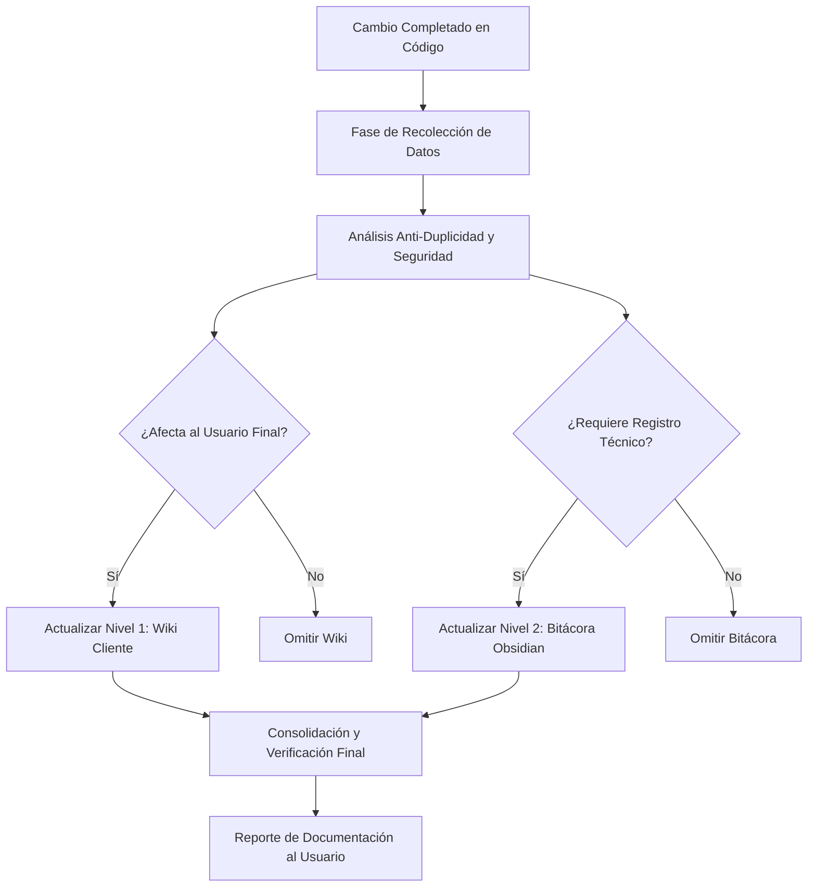

# Skill de Documentación y Auditoría Automática

Esta Skill tiene como propósito garantizar que cada corrección de bug, nueva funcionalidad u optimización realizada en la plataforma **Viw-Carta** sea auditada y documentada en tiempo real. Esto previene la fragmentación del conocimiento técnico y asegura un onboarding fluido tanto para clientes como para futuros desarrolladores.

---

## 🛡️ Protocolo de Auditoría y Calidad (Anti-Duplicidad)

Antes de generar o modificar cualquier documento, el asistente **DEBE** realizar un proceso de revisión interno basado en los siguientes tres pilares:

### 1. Análisis de Congruencia y Vacíos
* **Compatibilidad Arquitectónica:** Verifica que el cambio no contradiga los patrones establecidos (Next.js 15, base de datos MongoDB, tipado estricto sin `any`, guardias RBAC de servidor/cliente).
* **Contexto de Negocio:** Asegura que se explique el *porqué* detrás del cambio y sus implicaciones para el negocio multi-tenant.

### 2. Control de Duplicidad (Regla de Oro)
* **Principio de Documentación Limpia:** **NO** escribas contenido desde cero si ya existe información sobre el módulo o función.
* **Acción Correctiva:** Si el módulo ya existe, debes **editar, refactorizar o complementar** el archivo existente.
* **Criterio de División de Wiki (Nivel 1):**
  * Usa el archivo centralizado `01-Wiki-Cliente.md` para guías operativas generales y compactas.
  * Si un módulo crece significativamente en complejidad o requiere una guía visual extensa (ej. flujos detallados de pasarelas de pago, configuración avanzada de facturación electrónica), crea un archivo especializado dentro de `viw-carta/src/app/(docs)/wiki/<modulo>.md` y enlázalo desde la wiki o el índice principal.

### 3. Detección de Vulnerabilidades y Riesgos
Si el cambio involucra:
* Roles y permisos (RBAC).
* Datos de facturación, impuestos o datos de contribuyentes.
* Credenciales, llaves API, tokens o variables de entorno.
* Operaciones financieras afectadas por husos horarios (Timezone GMT-05:00).

Debes incluir de forma obligatoria una **Nota de Advertencia Estructurada** en la bitácora técnica usando el formato de alerta técnica:
> [!CAUTION]
> **TÍTULO DE LA ADVERTENCIA DE SEGURIDAD**
> * **Riesgo:** Descripción clara del impacto o vulnerabilidad.
> * **Mitigación:** Qué medidas específicas se han implementado para neutralizar el riesgo (ej. `checkApiPermission`, compensación UTC-5).

---

## 📁 Estructura de Documentación y Rutas Destino

### Nivel 1: Informativo (Manual/Wiki del Usuario)
* **Audiencia:** Clientes, administradores de restaurantes y usuarios finales.
* **Objetivo:** Explicar el funcionamiento de la plataforma de forma sencilla, fresca y orientada al valor (propuesta de valor de "fácil uso").
* **Ubicación:** `c:\Users\isaac\Desktop\Viw\viw-carta\src\app\(docs)\01-Wiki-Cliente.md` (o archivos específicos en `src/app\(docs)\wiki\`).
* **Estilo:** Tono profesional pero accesible, uso de alertas de tipo `> [!TIP]` y `> [!IMPORTANT]`, ejemplos prácticos aplicados a la operación del restaurante.

### Nivel 2: Bitácora y Mapa Técnico (Interno)
* **Audiencia:** Desarrollador principal (Isaac) y equipo técnico.
* **Objetivo:** Registrar decisiones de diseño, mapa técnico del sistema, control de deuda técnica e histórico de cambios (Changelog).
* **Ubicación:** `g:\Mi unidad\Cerebro_Digital\viw-powered\30_Proyectos_Vivos\33_viw-carta\📁 04_Bitacoras_y_Minutas (El historial de nuestras sesiones y decisiones)\`
* **Nomenclatura del archivo de minutas:** `YYYY-MM-DD-bitacora-cambios.md` (agrupando los cambios del día para evitar múltiples archivos pequeños, o complementando la bitácora existente del mes/módulo).

---

## 🔄 Flujo de Trabajo Obligatorio (Paso a Paso)

Cada vez que se complete un bugfix, refactor o feature, el asistente ejecutará este flujo:

### Paso 1: Recolección y Clasificación
Recopila los siguientes datos:
* **Módulo/Componente:** Qué parte del sistema fue afectada.
* **Tipo de Cambio:** Bugfix / Feature / Refactor / Optimización.
* **Impacto:** Si cambia la interacción del usuario final o si es puramente técnico/infraestructura.

### Paso 2: Análisis y Auditoría
1. Realiza una búsqueda (`grep_search` o inspección) en `src/app/(docs)` y en la bitácora de Obsidian para verificar si ya existe documentación previa de este módulo.
2. Identifica si el cambio introduce deudas técnicas o riesgos de seguridad.

### Paso 3: Actualización Documental

#### Para Nivel 1 (Wiki Cliente)
Si se requiere actualizar la Wiki, abre el archivo `01-Wiki-Cliente.md` (o el archivo específico en `wiki/` si es muy extenso):
* Si la sección existe: Modifica/añade el nuevo comportamiento manteniendo la coherencia de estilo.
* Si la sección no existe: Insértala de manera lógica en la estructura organizativa.

#### Para Nivel 2 (Bitácora Obsidian)
Crea o edita la minuta técnica correspondiente al día o módulo:
* Registra el cambio técnico con su justificación arquitectónica.
* Detalla los archivos modificados e interfaces afectadas.
* Inserta advertencias de seguridad (`[!CAUTION]`) si aplica.

### Paso 4: Cierre y Reporte
Presenta al usuario un resumen directo con enlaces físicos a los archivos documentados, detallando qué se editó y qué auditorías de duplicación/seguridad se aplicaron con éxito.
